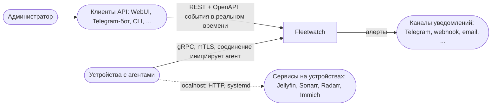
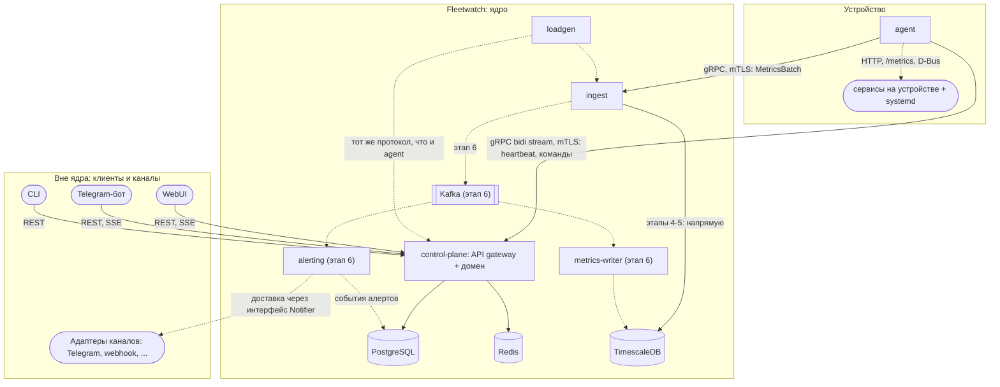

# 01. Модули и границы системы

- **Статус:** черновик v0.1
- **Дата:** 2026-10-08
- **Связанные документы:** 02-identity, 03-agent-protocol, 04-data, 05-metrics (пока не написаны)

## 1. Назначение

Fleetwatch отслеживает парк устройств (серверы homelab, NAS, рабочие станции) и сервисов на них, позволяет безопасно выполнять на устройствах заранее разрешённые команды и хранит метрики с алертингом. Всё управление идёт через **единый публичный API**. WebUI, Telegram-бот, CLI и любые другие клиенты являются его потребителями и не имеют привилегированного доступа к ядру.

Этот документ фиксирует **какие модули есть, за что отвечают и кто с кем говорит**. Детали протоколов, схемы данных и модель доверия описаны в отдельных документах.

### Не-цели

- Не замена Prometheus/Grafana: набор метрик ограничен, язык запросов не нужен.
- Не multi-tenant: один владелец, одна организация.
- Не продакшен-PKI: ключ CA лежит в файле (см. 02-identity).
- Не оркестратор: система не разворачивает сервисы, а наблюдает и выполняет allowlist-команды.
- Не привязана к конкретному клиенту: ни один фронтенд не является частью ядра.

## 2. Контекст (уровень 1)



| Участник | Роль | Примечание |
|---|---|---|
| Администратор | создаёт токены, смотрит состояние, отправляет команды | работает через любой клиент |
| Клиенты API | интерфейс для человека | заменяемы, ядро о них ничего не знает кроме типа клиента в аудите |
| Устройства | запускают агента, сами устанавливают соединение | серверу не нужен сетевой доступ к устройствам |
| Сервисы | источник метрик уровней L1/L2 | доступны только агенту на localhost, ключи API не покидают устройство |
| Каналы уведомлений | получатели исходящих алертов | подключаются адаптерами, набор расширяем |

## 3. Контейнеры (уровень 2)



Пунктир означает связь, которой пока нет (этап 6) или которая отличается от финальной. Блок «Вне ядра» это отдельные процессы или репозитории, которые зависят только от опубликованного API.

## 4. Ответственность модулей

| Модуль | Отвечает за | Владеет данными | Не делает | Протоколы |
|---|---|---|---|---|
| **agent** | сбор метрик, исполнение разрешённых команд, heartbeat, переподключение | локальный конфиг, ключ и сертификат устройства, буфер метрик | не принимает входящих соединений, не хранит секреты сервера, не исполняет произвольный shell | gRPC клиент; localhost HTTP, D-Bus |
| **control-plane** | enrollment и выдача сертификатов, идентичность устройств, состояние, команды, пользователи, клиенты и RBAC, аудит, **публичный API и поток событий для клиентов** | Postgres (кроме рядов метрик), Redis | не принимает метрики высокой частоты, не считает алерты, не содержит логики конкретных клиентов | gRPC сервер для агентов; REST и SSE для клиентов |
| **ingest** | приём батчей метрик, валидация, запись | ничем (stateless) | не принимает команды и не меняет состояние устройств | gRPC сервер; запись в Timescale, позже в Kafka |
| **metrics-writer** | чтение Kafka, пакетная запись в Timescale, DLQ | ряды метрик в Timescale | не отдаёт API | Kafka consumer |
| **alerting** | вычисление правил, формирование уведомлений, передача их в каналы | состояние правил | не знает, как устроен конкретный канал, не изменяет метрики и устройства | Kafka consumer; интерфейс `Notifier` |
| **Клиенты API** (WebUI, Telegram-бот, CLI) | представление и ввод | своё локальное состояние (сессии, привязки чатов) | не имеют собственной бизнес-логики и прямого доступа к БД, Redis и Kafka | только публичный API |
| **Адаптеры каналов** | доставка уведомления в конкретный канал | настройки канала | не вычисляют правила | зависит от канала |
| **loadgen** | имитация N агентов для нагрузочных тестов | ничем | не используется в продакшене | gRPC |

## 5. Контракт с клиентами

Это главное правило, которое делает фронт заменяемым.

1. **Единственный источник правды: OpenAPI-спецификация** (генерируется из кода, коммитится, изменения проверяются в CI). Клиенты и CLI могут генерироваться из неё.
2. **Нулевые привилегии у клиентов.** Любое действие, доступное WebUI, доступно и боту через тот же эндпоинт с теми же проверками прав. Скрытых «админских» ручек для собственного фронта нет.
3. **Ядро не отдаёт представление.** Никакого HTML или форматированных под мессенджер текстов в ответах API, только данные и коды ошибок. Форматирование это работа клиента.
4. **События в реальном времени.** Для подписки на изменения (статус устройства, результат команды, сработавший алерт) используется один механизм, **SSE** (опционально WebSocket позже). Клиентам не нужно опрашивать API.
5. **Единый формат ошибок и пагинация** для всех ресурсов.
6. **Версионирование API** (`/v1/...`). Несовместимые изменения только в новой версии.
7. **Аутентификация клиентов.** Каждый клиент получает собственные учётные данные (сервисный аккаунт или токен), а в аудите записывается и пользователь, и тип клиента. Как именно бот сопоставляет пользователя Telegram с пользователем системы, это вопрос бота, а не ядра (см. вопрос 7).

## 6. Исходящие уведомления

Клиент API и канал уведомлений это разные вещи, и держать их раздельно полезно:

| | Клиент API | Канал уведомлений |
|---|---|---|
| Направление | клиент запрашивает и подписывается | система отправляет сама |
| Инициатор | человек | событие алерта |
| Пример | открыл WebUI, отправил команду боту | алерт «устройство offline» ушёл в чат |
| Реализация | потребитель REST и SSE | адаптер за интерфейсом `Notifier` |

Telegram-бот может играть обе роли, но это два независимых механизма: интерактивная часть использует API, а доставка алертов использует адаптер.

```rust
trait Notifier: Send + Sync {
    fn channel(&self) -> &str;
    async fn send(&self, alert: &AlertEvent) -> Result<(), NotifyError>;
}
```

Правила, куда и что отправлять (маршрутизация по серьёзности, по устройству, по времени суток), хранятся в данных alerting. Новый канал это новый адаптер, ядро не меняется.

## 7. Владение хранилищами

| Хранилище | Содержимое | Единственный писатель | Читатели |
|---|---|---|---|
| PostgreSQL | устройства, токены, команды, пользователи, клиенты, аудит, outbox | control-plane | control-plane, alerting (события) |
| Redis | presence (TTL-ключи), pub/sub для потока событий | control-plane | control-plane |
| TimescaleDB | ряды метрик, агрегаты | ingest (этапы 4-5), metrics-writer (позже) | control-plane (запросы для API) |
| Kafka | `device.metrics`, `device.events`, `device.metrics.dlq` | ingest, control-plane (через outbox) | metrics-writer, alerting |

Правило: **у каждого хранилища ровно один писатель-владелец схемы**. Если появляется второй, это сигнал к пересмотру границ.

## 8. Принятые решения (по состоянию на сегодня)

| Решение | Статус | Где обосновано |
|---|---|---|
| Соединение всегда инициирует агент | решено | 03-agent-protocol |
| Идентичность через enrollment-токен и mTLS | решено | 02-identity |
| Метрики собираются агентом локально, секреты сервисов с сервера не передаются | решено | 05-metrics |
| Метрики идут отдельным путём (`ingest`), а не через стрим команд | предположение | см. вопрос 1 |
| Kafka появляется после работающего конвейера без неё | решено | 05-metrics |
| Любой клиент работает только через публичный API, ядро не знает о конкретных клиентах | решено | раздел 5 |
| Уведомления идут через интерфейс `Notifier`, отдельно от API клиентов | решено | раздел 6 |
| Монорепо для ядра, клиенты могут жить отдельно | предположение | ADR-0001 (написать) |

## 9. Открытые вопросы

1. **Один стрим или два.** Метрики через отдельный сервис `ingest` дают независимое масштабирование, но агенту нужны два соединения и две проверки идентичности. Альтернатива: передавать метрики в том же стриме и перенаправлять внутри control-plane, но тогда горячий путь живёт рядом с управлением.
2. **Как ingest узнаёт об отзыве устройства.** Ему нужно читать статус из Postgres или Redis, а это связь, которой на диаграмме нет. Варианты: кэш статусов в ingest, список отозванных в Redis, короткие сертификаты без проверки отзыва.
3. **Где живёт состояние alerting.** Правила и их текущие состояния (firing, resolved): в Postgres, в Redis или в самом процессе.
4. **Timescale в одном инстансе Postgres или отдельно.** В dev это одна база, в продакшене стоит решить, чтобы тяжёлые запросы не мешали control-plane.
5. **Кто отдаёт метрики в API.** Запросы рядов напрямую из Timescale через control-plane или отдельный read-сервис.
6. **Нужен ли отдельный сервис для outbox-relay** или это задача внутри control-plane.
7. **Как клиент получает права.** Один сервисный токен на бота (бот сам решает, кому из пользователей Telegram что можно) или привязка каждого пользователя чата к пользователю системы с передачей его прав. Второй вариант безопаснее, но сложнее.
8. **SSE или WebSocket для потока событий**, и откуда поток берётся (Redis pub/sub внутри control-plane или Kafka).
9. **Где живут клиенты:** в том же репозитории (проще, общий CI) или в отдельных (честнее проверяет, что API достаточен).
10. **Хранение настроек каналов и маршрутов алертов:** Postgres в схеме alerting или в control-plane через API.

## 10. Что дальше

- 02-identity: enrollment, сертификаты, отзыв (закроет вопрос 2).
- 03-agent-protocol: форма стрима и команды (закроет вопрос 1).
- 04-data: схема Postgres и Timescale (вопросы 3, 4).
- 06-api: ресурсы, события, аутентификация клиентов (вопросы 7, 8).
