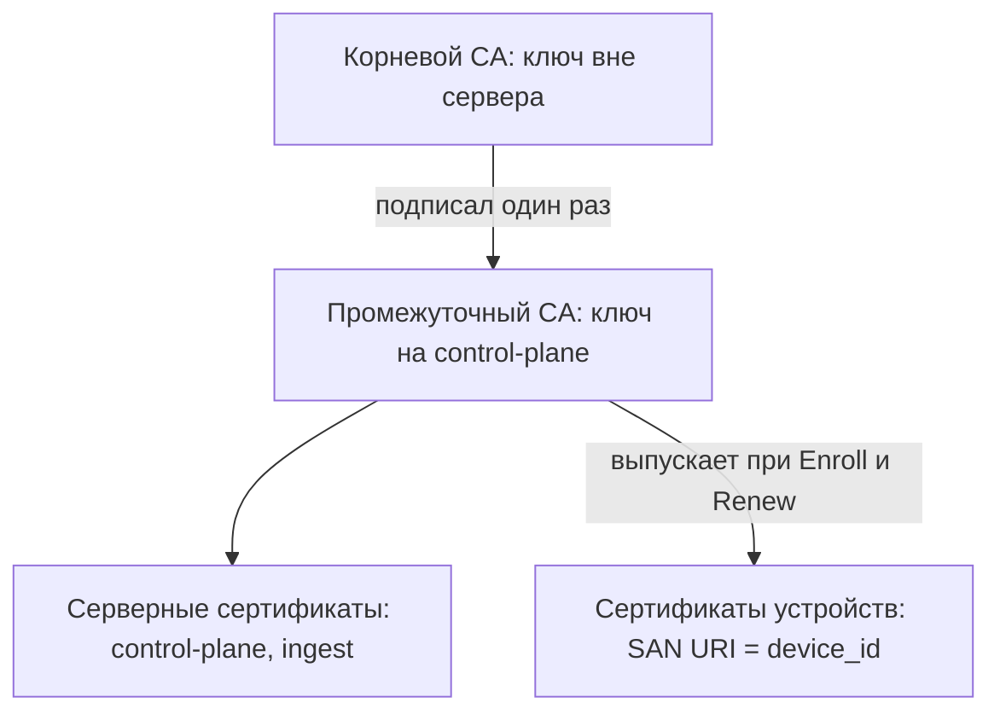
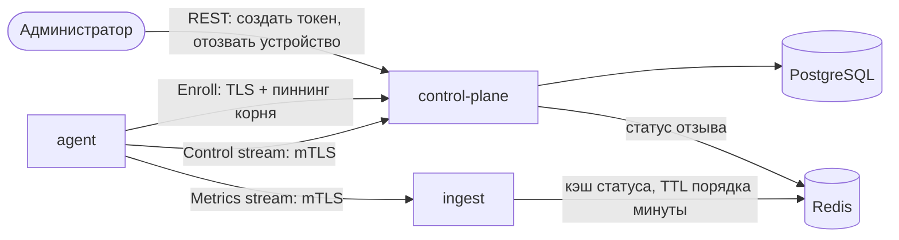
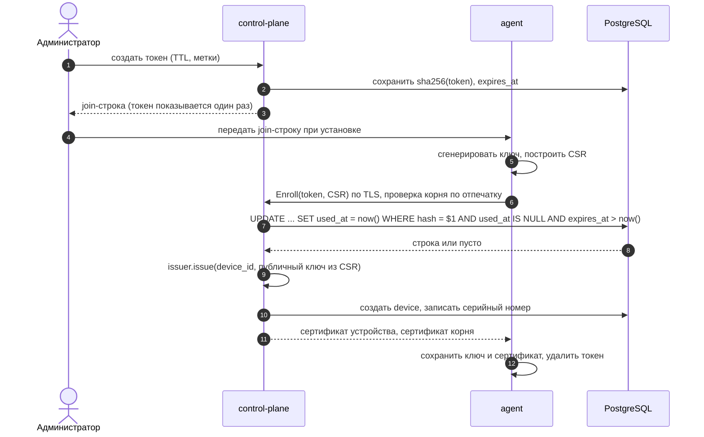
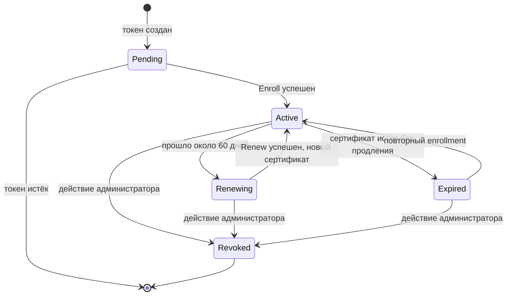
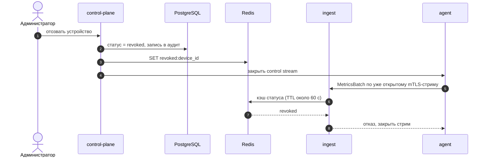

# 02. Идентичность устройств

- **Статус:** черновик v0.1
- **Дата:** 2026-10-08
- **Связанные документы:** 01-containers, 03-agent-protocol (не написан), 04-data (не написан)
- **Область:** только идентичность и доверие **устройств**. Идентичность пользователей и клиентов API будет описана в 06-api.

## 1. Цели и не-цели

### Цели

- К системе могут присоединиться только устройства, которые администратор разрешил заранее.
- У каждого устройства индивидуальная идентичность, поэтому метрики и команды нельзя перепутать, а в аудите видно, кто что сделал.
- Доступ можно отозвать у одного устройства, не затрагивая остальные.
- Компрометация сервера не раскрывает приватные ключи устройств.
- Компрометация промежуточного CA не требует перенастройки доверия на всём парке машин с агентами.

### Не-цели

- Не продакшен-PKI: нет HSM, нет CRL/OCSP, ротация корня не поддерживается.
- Не защищаем от root на самом устройстве и от злонамеренного администратора.
- Не описываем идентичность пользователей и клиентов API.

## 2. Понятия

| Термин | Значение |
|---|---|
| `device_id` | UUID устройства, назначается сервером при enrollment |
| Enrollment-токен | одноразовый секрет, которым устройство подтверждает разрешение на вступление |
| Join-строка | `<токен>@<хост:порт>#sha256:<отпечаток корня>`, передаётся агенту при установке |
| CSR | запрос на сертификат с публичным ключом, приватный ключ остаётся на устройстве |
| Корневой CA (root) | якорь доверия, ключ хранится вне сервера |
| Промежуточный CA (intermediate) | подписывает сертификаты устройств, ключ лежит на сервере |
| Статус устройства | `active` или `revoked`, живёт в Postgres, а не в сертификате |

## 3. Модель угроз

| Угроза | Мера | Остаточный риск |
|---|---|---|
| Посторонний регистрирует свое «устройство» | нужен валидный одноразовый токен | утечка токена до использования |
| Токен подсмотрели или он утёк | TTL порядка часов, одноразовость, в БД хранится хеш | в окне TTL токеном может воспользоваться другой |
| Подмена сервера при первом контакте | пиннинг отпечатка корня в join-строке | компрометация самой join-строки |
| Подмена одного устройства другим | `device_id` берётся из проверенного сертификата, а не из сообщений | кража приватного ключа с устройства |
| Скомпрометировано одно устройство | отзыв по `device_id`, разрыв стрима | окно доставки отзыва до `ingest` (см. раздел 7) |
| Утечка БД | в БД только хеши токенов и публичные данные | нет |
| Утечка промежуточного ключа | корень вне сервера, можно выпустить новый промежуточный | перевыпуск сертификатов всего парка |
| Перебор или флуд `Enroll` | rate limit, высокая энтропия токена, короткий TTL | DoS на публичный порт |

**Вне модели:** root на устройстве, злонамеренный администратор, компрометация корневого ключа.

## 4. Архитектура доверия



| Элемент | Где хранится | Кто использует |
|---|---|---|
| Приватный ключ корня | вне сервера (шифрованный файл у администратора) | только при выпуске или смене промежуточного |
| Сертификат корня (публичный) | у агентов, control-plane, ingest | проверка цепочки |
| Приватный ключ промежуточного | control-plane, через `LoadCredential`, права 0600 | подпись сертификатов устройств |
| Приватный ключ устройства | устройство, генерируется агентом локально | mTLS-соединения |

Агент и серверы доверяют **корню**. Отпечаток корня вшивается в join-строку и используется для пиннинга при первом контакте.

## 5. Компоненты и ответственность



| Компонент | Роль в идентичности |
|---|---|
| **agent** | генерирует ключ, строит CSR, хранит сертификат, продлевает его |
| **control-plane** | единственный, кто выдаёт сертификаты и меняет статус устройства. Принимает `Enroll` и `Renew` |
| **ingest** | только проверяет цепочку и статус устройства. Сертификаты не выпускает |
| **Postgres** | источник правды: токены, устройства, серийные номера |
| **Redis** | распространяет статус отзыва, чтобы `ingest` не ходил в Postgres |

Подпись выполняется внутри control-plane за трейтом, чтобы реализацию можно было заменить на `step-ca` или Vault:

```rust
#[async_trait]
trait CertificateIssuer: Send + Sync {
    async fn issue(&self, req: IssueRequest) -> Result<IssuedCert, IssueError>;
}
```

Вызывается он только из двух мест: `Enroll` и `Renew`. Других путей выпуска быть не должно.

## 6. Enrollment



Правила:

- **Токен.** 256 бит случайных данных, в БД хранится `sha256`, сравнение за константное время. Показывается администратору один раз.
- **Одноразовость** обеспечивается атомарным `UPDATE ... WHERE used_at IS NULL`, а не проверкой в коде приложения.
- **TTL.** Часы. Конкретное значение по умолчанию: открытый вопрос 1.
- **Метаданные токена** (имя, метки, роль устройства) переходят в запись устройства.
- **Из CSR берётся только публичный ключ.** Subject, SAN, срок и `extendedKeyUsage` задаёт сервер. Иначе агент мог бы запросить сертификат на чужой `device_id`.
- **Пиннинг.** Агент отказывается продолжать, если корень в цепочке сервера не совпал с отпечатком из join-строки.
- **Защита `Enroll`.** Rate limit по IP, одинаковый ответ на любой отказ (не раскрывать, истёк токен или не существует), запись неудачных попыток в аудит.

## 7. Сертификат устройства

| Поле | Значение |
|---|---|
| Subject Alternative Name | URI: `spiffe://fleetwatch/device/<uuid>` (формат условный, SPIRE не используется) |
| Срок действия | 90 дней |
| extendedKeyUsage | только `clientAuth` |
| basicConstraints | `CA:FALSE` |
| Серийный номер | случайный, уникальный, сохраняется в БД |

Ограничения промежуточного CA: `pathLenConstraint = 0` (не может выпускать подчинённые CA).

**Где берётся `device_id`.** Сервер извлекает его из проверенного клиентского сертификата (в tonic это интерсептор, кладущий `DeviceId` в расширения запроса). Идентификатор из тела сообщения не используется никогда.

## 8. Жизненный цикл



Статусы `Active` и `Revoked` хранятся в Postgres на уровне **устройства**. `Renewing` и `Expired` производные от срока сертификата.

### Продление

- Агент начинает продление примерно на 60-й день из 90 (за треть до конца). Остаётся запас порядка 30 дней на устройство, которое может быть выключено.
- `Renew` выполняется **по уже работающему mTLS-каналу** (контрольный стрим или отдельный unary-вызов). Агент присылает новый CSR с новым ключом.
- Старый сертификат остаётся действительным до своего срока. Серийные номера обоих сохраняются для аудита.
- Если продление не удалось, агент повторяет с backoff и пишет предупреждение в метрики (`cert_expires_in_seconds`).

### Истёкший сертификат

Устройство, которое было выключено дольше срока, приходит с просроченным сертификатом. **В v1 продление по просроченному сертификату не допускается**: нужен повторный enrollment с новым токеном. Это проще и безопаснее. См. вопрос 3.

### Переустановка

Устройство потеряло ключ (переустановили ОС). Два варианта: новый токен и новая запись, либо администратор явно привязывает новый ключ к старому `device_id`. Решение: вопрос 4.

## 9. Отзыв

**Источник правды** это поле статуса устройства в Postgres. Сертификаты не отзываются по отдельности, отзывается устройство целиком.



### Решение для `ingest` (предположение)

`ingest` проверяет **цепочку** сертификата локально, а **статус устройства** сверяет через Redis с локальным кэшем с коротким TTL.

| Вариант | Оценка |
|---|---|
| Кэш статуса в ingest с TTL около минуты | **выбрано в качестве предположения**: просто, окно отзыва ограничено TTL |
| Хождение в Postgres на каждый батч | отвергнуто: горячий путь не должен зависеть от Postgres |
| Короткие сертификаты без проверки статуса | отвергнуто: 90 дней слишком много, чтобы полагаться на истечение |

**Допустимое окно:** отозванное устройство может слать метрики до одного TTL кэша после отзыва (порядка минуты). Ключевая цифра раздела: если нужно жёстче, TTL уменьшается, а нагрузка на Redis растёт.

Важная деталь: стрим долгоживущий, поэтому статус проверяется **не только при установке соединения, а периодически и на каждый батч (по кэшу)**. Иначе уже открытый стрим продолжал бы работать после отзыва.

В control-plane всё проще: стрим держит он сам, поэтому при отзыве соединение закрывается немедленно.

## 10. Управление CA

| Тема | Решение v1 |
|---|---|
| Иерархия | root (вне сервера) + intermediate (на сервере) |
| Создание | одноразовый скрипт в репозитории, запускается руками |
| Хранение ключа промежуточного | `LoadCredential`, права 0600, не в переменных окружения |
| Ротация промежуточного | поддерживается: выпускается новый, парк перевыпускает сертификаты через `Renew`, пока старый ещё действителен |
| Ротация корня | **не поддерживается в v1**, потребует повторного enrollment всего парка |
| Продакшен-вариант | HSM или Vault PKI, либо `step-ca` через реализацию `CertificateIssuer` |

## 11. Транспорт

| Вызов | Что аутентифицируется | Как |
|---|---|---|
| `Enroll` | сервер агентом | TLS, цепочка проверяется по отпечатку корня; клиентской аутентификации нет, вместо неё токен |
| Control stream | обе стороны | mTLS |
| Metrics stream | обе стороны | mTLS (ingest доверяет тому же корню) |
| Публичный API | клиенты | в 06-api |

Версия TLS и наборы шифров берутся из дефолтов `rustls`. Менять их без причины не нужно.

## 12. Аудит

Пишутся события: токен создан, токен использован, токен просрочен или отвергнут, сертификат выпущен (с серийным номером), сертификат продлён, устройство отозвано, неудачная попытка `Enroll` (источник, причина). В записи: время, `device_id` (если есть), источник, администратор или система.

## 13. Данные

Подробная схема в 04-data. Здесь только перечень полей.

| Сущность | Ключевые поля |
|---|---|
| `enrollment_tokens` | id, token_hash, expires_at, used_at, labels, created_by |
| `devices` | id, name, labels, status, enrolled_at, revoked_at |
| `device_certificates` | serial, device_id, issued_at, expires_at, superseded_at |

## 14. Что сознательно упрощено

| Упрощение | Почему допустимо | В продакшене |
|---|---|---|
| Ключ промежуточного CA в файле | один оператор, малый масштаб | HSM, Vault, step-ca |
| Нет CRL и OCSP | отзыв по статусу устройства через Redis | OCSP stapling или короткие сертификаты |
| Нет ротации корня | один раз создаётся, редко меняется | процедура перехода с двумя корнями |
| Простая join-строка | вручную передаёт администратор | подписанный пакет установки, OIDC для устройств |

## 15. Открытые вопросы

1. **TTL enrollment-токена по умолчанию.** Один час, сутки?
2. **Окно отзыва.** Подходит ли TTL кэша около минуты или нужно жёстче?
3. **Просроченный сертификат.** Подтвердить, что в v1 только повторный enrollment, без льготного периода продления.
4. **Переустановка устройства.** Новый `device_id` или перепривязка ключа к старому?
5. **Один порт или два.** `Enroll` на отдельном порту без mTLS проще защищать rate limit-ом, но это ещё один открытый порт.
6. **Нужен ли `device_certificates` в БД целиком** или достаточно серийного номера действующего сертификата в `devices`.
7. **Подпись команд.** Подписывать ли команды ключом сервера (тема документа 03, но привязана к CA).
8. **Как `ingest` получает сертификат корня и свой серверный сертификат** при деплое (через Nix-модуль, `LoadCredential`).
