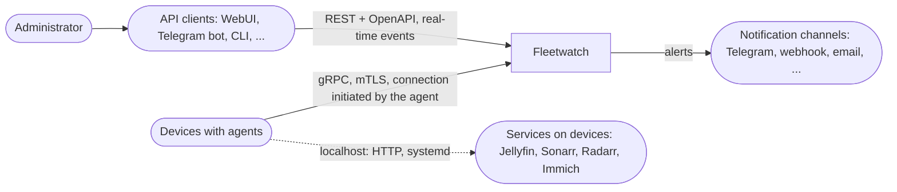
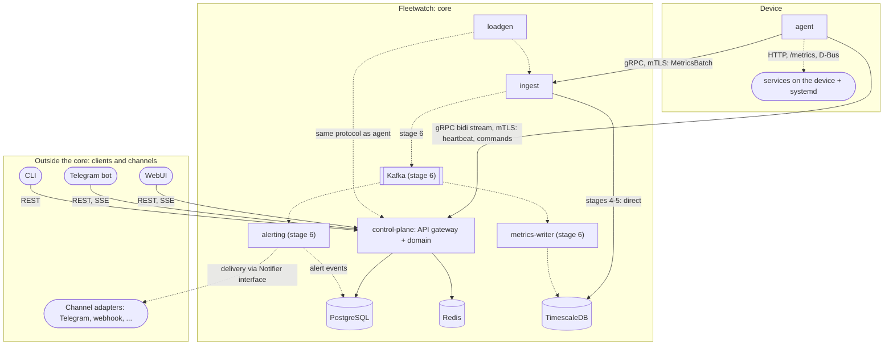

# 01. Modules and System Boundaries

- **Status:** draft v0.1
- **Date:** 2026-10-08
- **Related documents:** 02-identity, 03-agent-protocol, 04-data, 05-metrics (not written yet)

## 1. Purpose

Fleetwatch tracks a fleet of devices (homelab servers, NAS, workstations) and the services running on them. It lets you safely run pre-approved commands on devices, and it stores metrics with alerting. All management goes through a **single public API**. The WebUI, Telegram bot, CLI and any other clients are consumers of that API and have no privileged access to the core.

This document records **which modules exist, what each is responsible for, and who talks to whom**. Protocol details, data schemas and the trust model are described in separate documents.

### Non-goals

- Not a replacement for Prometheus/Grafana: the set of metrics is limited and no query language is needed.
- Not multi-tenant: one owner, one organization.
- Not production-grade PKI: the CA key lives in a file (see 02-identity).
- Not an orchestrator: the system does not deploy services, it observes them and runs allowlisted commands.
- Not tied to a specific client: no frontend is part of the core.

## 2. Context (level 1)



| Actor                 | Role                                                  | Notes                                                                                           |
| --------------------- | ----------------------------------------------------- | ----------------------------------------------------------------------------------------------- |
| Administrator         | creates tokens, views state, sends commands           | works through any client                                                                        |
| API clients           | human-facing interface                                | replaceable; the core knows nothing about them except the client type recorded in the audit log |
| Devices               | run the agent and establish the connection themselves | the server needs no network access to devices                                                   |
| Services              | source of L1/L2 metrics                               | reachable only by the agent on localhost; API keys never leave the device                       |
| Notification channels | recipients of outgoing alerts                         | plugged in as adapters; the set is extensible                                                   |

## 3. Containers (level 2)



A dashed line means a connection that does not exist yet (stage 6) or that differs from the final design. The "Outside the core" block consists of separate processes or repositories that depend only on the published API.

## 4. Module responsibilities

| Module                                     | Responsible for                                                                                                                                    | Owns data                                                | Does not do                                                                                         | Protocols                                        |
| ------------------------------------------ | -------------------------------------------------------------------------------------------------------------------------------------------------- | -------------------------------------------------------- | --------------------------------------------------------------------------------------------------- | ------------------------------------------------ |
| **agent**                                  | metric collection, running allowed commands, heartbeat, reconnection                                                                               | local config, device key and certificate, metrics buffer | does not accept incoming connections, does not store server secrets, does not run arbitrary shell   | gRPC client; localhost HTTP, D-Bus               |
| **control-plane**                          | enrollment and certificate issuance, device identity, state, commands, users, clients and RBAC, audit, **public API and event stream for clients** | Postgres (except metric series), Redis                   | does not accept high-frequency metrics, does not evaluate alerts, contains no client-specific logic | gRPC server for agents; REST and SSE for clients |
| **ingest**                                 | receiving metric batches, validation, writing                                                                                                      | nothing (stateless)                                      | does not accept commands and does not change device state                                           | gRPC server; writes to Timescale, later to Kafka |
| **metrics-writer**                         | reading Kafka, batch writes to Timescale, DLQ                                                                                                      | metric series in Timescale                               | does not serve an API                                                                               | Kafka consumer                                   |
| **alerting**                               | evaluating rules, building notifications, handing them to channels                                                                                 | rule state                                               | does not know how a specific channel works, does not modify metrics or devices                      | Kafka consumer; `Notifier` interface             |
| **API clients** (WebUI, Telegram bot, CLI) | presentation and input                                                                                                                             | their own local state (sessions, chat bindings)          | have no business logic of their own and no direct access to the DB, Redis or Kafka                  | public API only                                  |
| **Channel adapters**                       | delivering a notification to a specific channel                                                                                                    | channel settings                                         | do not evaluate rules                                                                               | depends on the channel                           |
| **loadgen**                                | simulating N agents for load tests                                                                                                                 | nothing                                                  | not used in production                                                                              | gRPC                                             |

## 5. Client contract

This is the main rule that makes the frontend replaceable.

1. **The single source of truth is the OpenAPI specification** (generated from code, committed, changes checked in CI). Clients and the CLI can be generated from it.
2. **Clients have zero privileges.** Any action available to the WebUI is available to the bot through the same endpoint with the same permission checks. There are no hidden "admin" endpoints for our own frontend.
3. **The core does not serve presentation.** No HTML or messenger-formatted text in API responses, only data and error codes. Formatting is the client's job.
4. **Real-time events.** A single mechanism, **SSE** (optionally WebSocket later), is used to subscribe to changes (device status, command result, fired alert). Clients do not need to poll the API.
5. **A uniform error format and pagination** for all resources.
6. **API versioning** (`/v1/...`). Breaking changes only in a new version.
7. **Client authentication.** Each client gets its own credentials (a service account or token), and the audit log records both the user and the client type. How exactly the bot maps a Telegram user to a system user is the bot's concern, not the core's (see question 7).

## 6. Outgoing notifications

An API client and a notification channel are different things, and keeping them separate is useful:

|                | API client                                  | Notification channel                    |
| -------------- | ------------------------------------------- | --------------------------------------- |
| Direction      | the client requests and subscribes          | the system sends on its own             |
| Initiator      | a human                                     | an alert event                          |
| Example        | opened the WebUI, sent a command to the bot | a "device offline" alert went to a chat |
| Implementation | consumer of REST and SSE                    | adapter behind the `Notifier` interface |

A Telegram bot can play both roles, but they are two independent mechanisms: the interactive part uses the API, and alert delivery uses an adapter.

```rust
trait Notifier: Send + Sync {
    fn channel(&self) -> &str;
    async fn send(&self, alert: &AlertEvent) -> Result<(), NotifyError>;
}
```

The rules for where and what to send (routing by severity, by device, by time of day) are stored in alerting data. A new channel is a new adapter; the core does not change.

## 7. Storage ownership

| Storage     | Contents                                                 | Sole writer                                 | Readers                             |
| ----------- | -------------------------------------------------------- | ------------------------------------------- | ----------------------------------- |
| PostgreSQL  | devices, tokens, commands, users, clients, audit, outbox | control-plane                               | control-plane, alerting (events)    |
| Redis       | presence (TTL keys), pub/sub for the event stream        | control-plane                               | control-plane                       |
| TimescaleDB | metric series, aggregates                                | ingest (stages 4-5), metrics-writer (later) | control-plane (queries for the API) |
| Kafka       | `device.metrics`, `device.events`, `device.metrics.dlq`  | ingest, control-plane (via outbox)          | metrics-writer, alerting            |

Rule: **each storage has exactly one writer that owns its schema**. If a second one appears, that is a signal to revisit the boundaries.

## 8. Decisions made (as of today)

| Decision                                                                                    | Status     | Rationale in             |
| ------------------------------------------------------------------------------------------- | ---------- | ------------------------ |
| The agent always initiates the connection                                                   | decided    | 03-agent-protocol        |
| Identity via enrollment token and mTLS                                                      | decided    | 02-identity              |
| Metrics are collected locally by the agent; service secrets are never sent to the server    | decided    | 05-metrics               |
| Metrics take a separate path (`ingest`) rather than going through the command stream        | assumption | see question 1           |
| Kafka is introduced after the pipeline works without it                                     | decided    | 05-metrics               |
| Any client works only through the public API; the core does not know about specific clients | decided    | section 5                |
| Notifications go through the `Notifier` interface, separate from API clients                | decided    | section 6                |
| Monorepo for the core; clients may live separately                                          | assumption | ADR-0001 (to be written) |
| Separate streams for `control-plane` and `ingest`                                           | decided    | ADR-0002 (to be written) |

## 9. Open questions

1. **How ingest learns about device revocation.** It would need to read status from Postgres or Redis, a connection that is not on the diagram. Options: a status cache in ingest, a revoked list in Redis, short-lived certificates with no revocation check.
2. **Where alerting state lives.** Rules and their current states (firing, resolved): in Postgres, in Redis, or in the process itself.
3. **Timescale in the same Postgres instance or separate.** In dev it is one database; in production it is worth separating so heavy queries do not affect control-plane.
4. **Who serves metrics to the API.** Series queries straight from Timescale via control-plane, or a separate read service.
5. **Whether a separate service is needed for the outbox relay** or whether it is a task inside control-plane.
6. **How a client gets permissions.** One service token per bot (the bot itself decides which Telegram users may do what), or binding each chat user to a system user and passing along that user's permissions. The second is safer but more complex.
7. **SSE or WebSocket for the event stream**, and where the stream comes from (Redis pub/sub inside control-plane, or Kafka).
8. **Where clients live:** in the same repository (simpler, shared CI) or in separate ones (a more honest check that the API is sufficient).
9. **Where channel settings and alert routes are stored:** Postgres in the alerting schema, or in control-plane via the API.

## 10. Next steps

- 03-agent-protocol: stream shape and commands (will close question 1).
- 04-data: Postgres and Timescale schema (questions 3, 4).
- 06-api: resources, events, client authentication (questions 7, 8).
