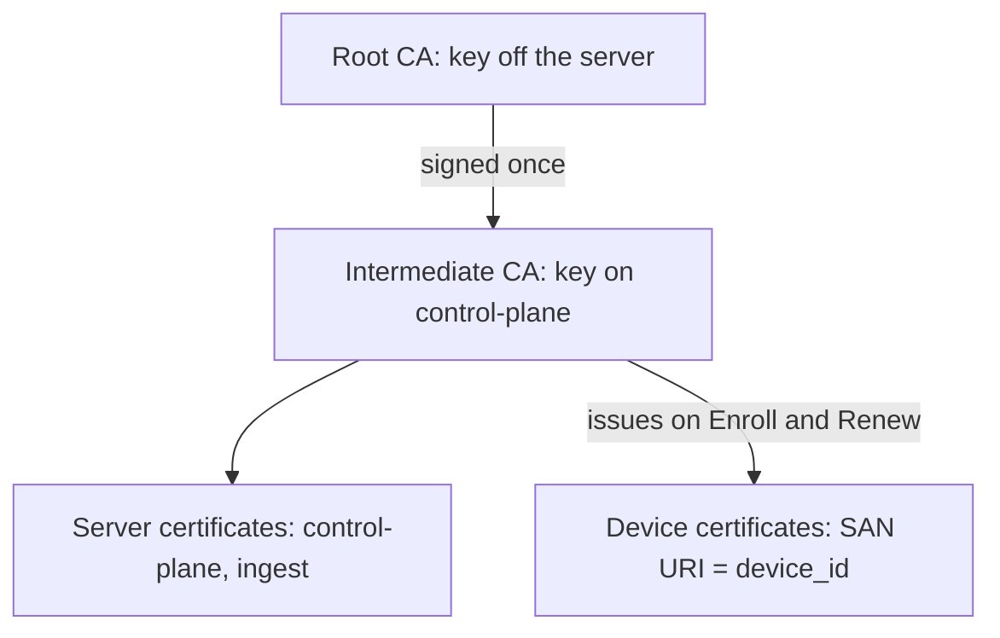
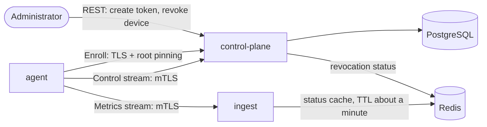
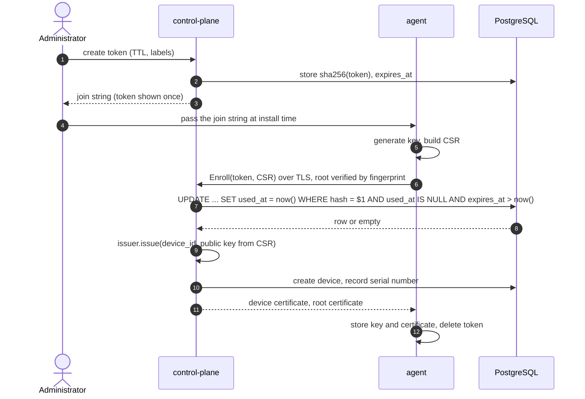
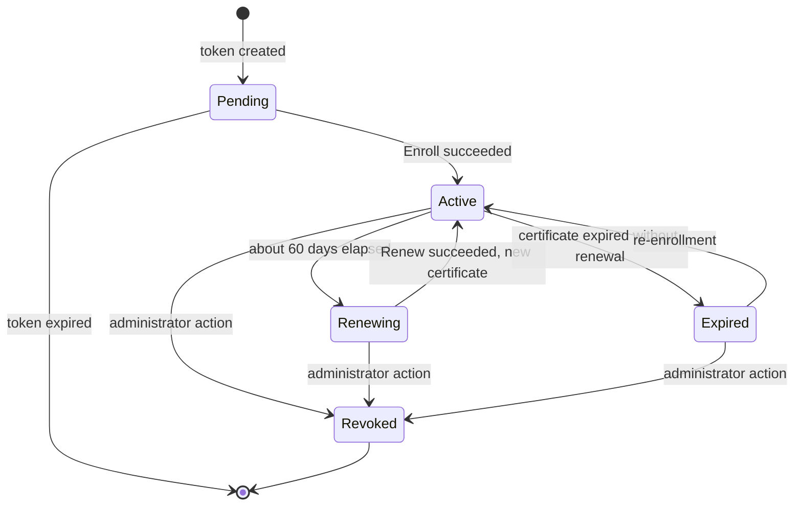
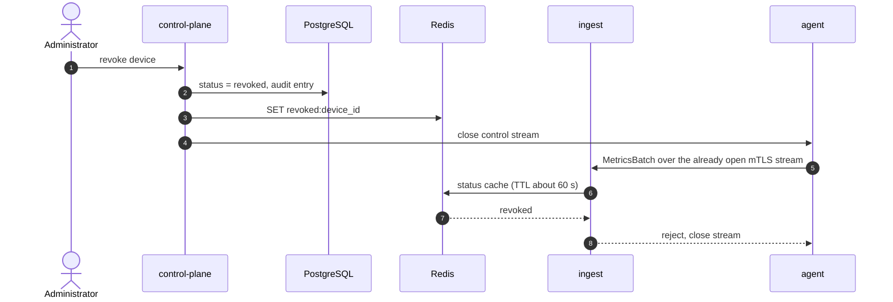

# 02. Device Identity

- **Status:** draft v0.1
- **Date:** 2026-10-08
- **Related documents:** 01-containers, 03-agent-protocol (not written), 04-data (not written)
- **Scope:** identity and trust for **devices** only. User and API client identity will be described in 06-api.

## 1. Goals and non-goals

### Goals

- Only devices the administrator has approved in advance can join the system.
- Each device has an individual identity, so metrics and commands cannot be mixed up and the audit log shows who did what.
- Access can be revoked for a single device without affecting the others.
- Compromise of the server does not expose device private keys.
- Compromise of the intermediate CA does not require reconfiguring trust across the whole fleet of agent machines.

### Non-goals

- Not production-grade PKI: no HSM, no CRL/OCSP, root rotation is not supported.
- No protection against root on the device itself or against a malicious administrator.
- Does not describe user and API client identity.

## 2. Concepts

| Term             | Meaning                                                                             |
| ---------------- | ----------------------------------------------------------------------------------- |
| `device_id`      | Device UUID, assigned by the server at enrollment                                   |
| Enrollment token | A one-time secret the device uses to prove it is allowed to join                    |
| Join string      | `<token>@<host:port>#sha256:<root fingerprint>`, given to the agent at install time |
| CSR              | Certificate request containing the public key; the private key stays on the device  |
| Root CA          | Trust anchor; its key is stored off the server                                      |
| Intermediate CA  | Signs device certificates; its key lives on the server                              |
| Device status    | `active` or `revoked`; lives in Postgres, not in the certificate                    |

## 3. Threat model

| Threat                                   | Mitigation                                                            | Residual risk                                          |
| ---------------------------------------- | --------------------------------------------------------------------- | ------------------------------------------------------ |
| An outsider registers their own "device" | a valid one-time token is required                                    | token leaked before use                                |
| The token is observed or leaks           | TTL on the order of hours, single use, only a hash stored in the DB   | within the TTL window someone else can use the token   |
| Server impersonation on first contact    | root fingerprint pinned in the join string                            | the join string itself is compromised                  |
| One device impersonates another          | `device_id` is taken from the verified certificate, not from messages | theft of the private key from the device               |
| A single device is compromised           | revocation by `device_id`, stream teardown                            | revocation delivery window to `ingest` (see section 9) |
| DB leak                                  | the DB holds only token hashes and public data                        | none                                                   |
| Intermediate key leak                    | root is off the server, a new intermediate can be issued              | reissuing certificates for the whole fleet             |
| Brute force or flood of `Enroll`         | rate limit, high-entropy token, short TTL                             | DoS on the public port                                 |

**Out of the model:** root on the device, a malicious administrator, compromise of the root key.

## 4. Trust architecture



| Element                   | Where stored                                              | Who uses it                                     |
| ------------------------- | --------------------------------------------------------- | ----------------------------------------------- |
| Root private key          | off the server (encrypted file held by the administrator) | only when issuing or replacing the intermediate |
| Root certificate (public) | agents, control-plane, ingest                             | chain verification                              |
| Intermediate private key  | control-plane, via `LoadCredential`, mode 0600            | signing device certificates                     |
| Device private key        | the device, generated locally by the agent                | mTLS connections                                |

The agent and servers trust the **root**. The root fingerprint is embedded in the join string and used for pinning on first contact.

## 5. Components and responsibilities



| Component         | Role in identity                                                                                    |
| ----------------- | --------------------------------------------------------------------------------------------------- |
| **agent**         | generates the key, builds the CSR, stores the certificate, renews it                                |
| **control-plane** | the only component that issues certificates and changes device status. Handles `Enroll` and `Renew` |
| **ingest**        | only verifies the chain and device status. Does not issue certificates                              |
| **Postgres**      | source of truth: tokens, devices, serial numbers                                                    |
| **Redis**         | distributes revocation status so `ingest` does not have to query Postgres                           |

Signing happens inside control-plane behind a trait, so the implementation can be swapped for `step-ca` or Vault:

```rust
#[async_trait]
trait CertificateIssuer: Send + Sync {
    async fn issue(&self, req: IssueRequest) -> Result<IssuedCert, IssueError>;
}
```

It is called from only two places: `Enroll` and `Renew`. There must be no other issuance paths.

## 6. Enrollment



Rules:

- **Token.** 256 bits of random data; the DB stores its `sha256`, compared in constant time. Shown to the administrator once.
- **Single use** is enforced by an atomic `UPDATE ... WHERE used_at IS NULL`, not by a check in application code.
- **TTL.** Hours. The specific default is open question 1.
- **Token metadata** (name, labels, device role) is carried over to the device record.
- **Only the public key is taken from the CSR.** Subject, SAN, validity and `extendedKeyUsage` are set by the server. Otherwise an agent could request a certificate for someone else's `device_id`.
- **Pinning.** The agent refuses to continue if the root in the server's chain does not match the fingerprint from the join string.
- **Protecting `Enroll`.** Per-IP rate limit, an identical response for every failure (do not reveal whether the token expired or never existed), failed attempts written to the audit log.

## 7. Device certificate

| Field                    | Value                                                                        |
| ------------------------ | ---------------------------------------------------------------------------- |
| Subject Alternative Name | URI: `spiffe://fleetwatch/device/<uuid>` (nominal format, SPIRE is not used) |
| Validity                 | 90 days                                                                      |
| extendedKeyUsage         | `clientAuth` only                                                            |
| basicConstraints         | `CA:FALSE`                                                                   |
| Serial number            | random, unique, stored in the DB                                             |

Intermediate CA constraints: `pathLenConstraint = 0` (cannot issue subordinate CAs).

**Where `device_id` comes from.** The server extracts it from the verified client certificate (in tonic, an interceptor that puts `DeviceId` into the request extensions). An identifier from the message body is never used.

## 8. Lifecycle



The `Active` and `Revoked` statuses are stored in Postgres at the **device** level. `Renewing` and `Expired` are derived from the certificate's validity.

### Renewal

- The agent starts renewal at around day 60 of 90 (a third before the end). That leaves roughly 30 days of margin for a device that may be powered off.
- `Renew` is performed **over the already working mTLS channel** (the control stream or a separate unary call). The agent sends a new CSR with a new key.
- The old certificate remains valid until its expiry. Serial numbers of both are kept for audit.
- If renewal fails, the agent retries with backoff and emits a warning in metrics (`cert_expires_in_seconds`).

### Expired certificate

A device that was off for longer than the validity period shows up with an expired certificate. **In v1, renewal with an expired certificate is not allowed**: re-enrollment with a new token is required. This is simpler and safer. See question 3.

### Reinstallation

The device lost its key (the OS was reinstalled). Two options: a new token and a new record, or the administrator explicitly binds the new key to the old `device_id`. To be decided: question 4.

## 9. Revocation

The **source of truth** is the device status field in Postgres. Certificates are not revoked individually; the device is revoked as a whole.



### Decision for `ingest` (assumption)

`ingest` verifies the certificate **chain** locally and checks the **device status** through Redis with a local short-TTL cache.

| Option                                              | Assessment                                                                       |
| --------------------------------------------------- | -------------------------------------------------------------------------------- |
| Status cache in ingest with a TTL of about a minute | **chosen as an assumption**: simple, the revocation window is bounded by the TTL |
| Querying Postgres for every batch                   | rejected: the hot path must not depend on Postgres                               |
| Short-lived certificates with no status check       | rejected: 90 days is too long to rely on expiry                                  |

**Acceptable window:** a revoked device can keep sending metrics for up to one cache TTL after revocation (on the order of a minute). This is the key number of the section: if it needs to be tighter, the TTL is reduced and the load on Redis grows.

An important detail: the stream is long-lived, so the status is checked **not only when the connection is established, but periodically and on every batch (via the cache)**. Otherwise an already open stream would keep working after revocation.

In control-plane it is simpler: it holds the stream itself, so the connection is closed immediately on revocation.

## 10. CA management

| Topic                    | v1 decision                                                                                                  |
| ------------------------ | ------------------------------------------------------------------------------------------------------------ |
| Hierarchy                | root (off the server) + intermediate (on the server)                                                         |
| Creation                 | a one-off script in the repository, run by hand                                                              |
| Intermediate key storage | `LoadCredential`, mode 0600, not in environment variables                                                    |
| Intermediate rotation    | supported: a new one is issued, the fleet reissues certificates via `Renew` while the old one is still valid |
| Root rotation            | **not supported in v1**, would require re-enrolling the whole fleet                                          |
| Production variant       | HSM or Vault PKI, or `step-ca` via a `CertificateIssuer` implementation                                      |

## 11. Transport

| Call           | What is authenticated    | How                                                                                                   |
| -------------- | ------------------------ | ----------------------------------------------------------------------------------------------------- |
| `Enroll`       | the server, by the agent | TLS, chain verified against the root fingerprint; no client authentication, the token takes its place |
| Control stream | both sides               | mTLS                                                                                                  |
| Metrics stream | both sides               | mTLS (ingest trusts the same root)                                                                    |
| Public API     | clients                  | in 06-api                                                                                             |

TLS version and cipher suites come from the `rustls` defaults. There is no need to change them without a reason.

## 12. Audit

Recorded events: token created, token used, token expired or rejected, certificate issued (with serial number), certificate renewed, device revoked, failed `Enroll` attempt (source, reason). Each record has: time, `device_id` (if any), source, administrator or system.

## 13. Data

The detailed schema is in 04-data. Only the list of fields is given here.

| Entity                | Key fields                                              |
| --------------------- | ------------------------------------------------------- |
| `enrollment_tokens`   | id, token_hash, expires_at, used_at, labels, created_by |
| `devices`             | id, name, labels, status, enrolled_at, revoked_at       |
| `device_certificates` | serial, device_id, issued_at, expires_at, superseded_at |

## 14. What is deliberately simplified

| Simplification                | Why it is acceptable                      | In production                             |
| ----------------------------- | ----------------------------------------- | ----------------------------------------- |
| Intermediate CA key in a file | single operator, small scale              | HSM, Vault, step-ca                       |
| No CRL or OCSP                | revocation by device status via Redis     | OCSP stapling or short-lived certificates |
| No root rotation              | created once, rarely changed              | a migration procedure with two roots      |
| Simple join string            | handed over manually by the administrator | signed install package, OIDC for devices  |

## 15. Open questions

1. **Default enrollment token TTL.** One hour, one day?
2. **Revocation window.** Is a cache TTL of about a minute acceptable, or does it need to be tighter?
3. **Expired certificate.** Confirm that in v1 it is re-enrollment only, with no renewal grace period.
4. **Device reinstallation.** A new `device_id`, or rebinding the key to the old one?
5. **One port or two.** `Enroll` on a separate port without mTLS is easier to protect with a rate limit, but it is one more open port.
6. **Whether `device_certificates` is needed in the DB in full**, or whether the serial of the current certificate in `devices` is enough.
7. **Command signing.** Whether to sign commands with the server key (a topic for document 03, but tied to the CA).
8. **How `ingest` obtains the root certificate and its own server certificate** at deployment (via a Nix module, `LoadCredential`).
