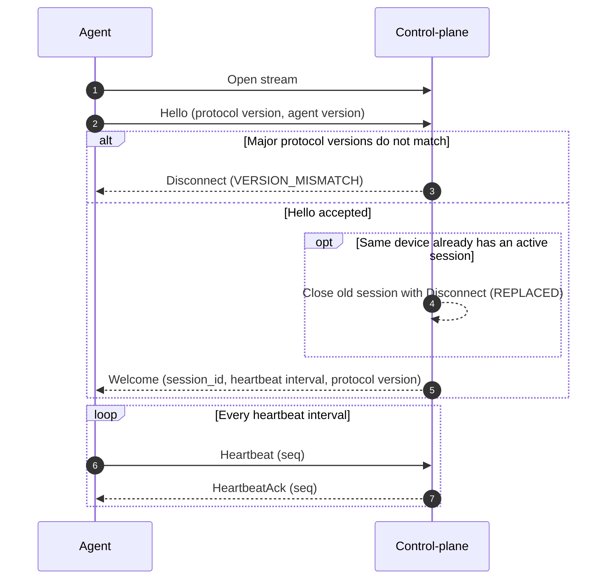
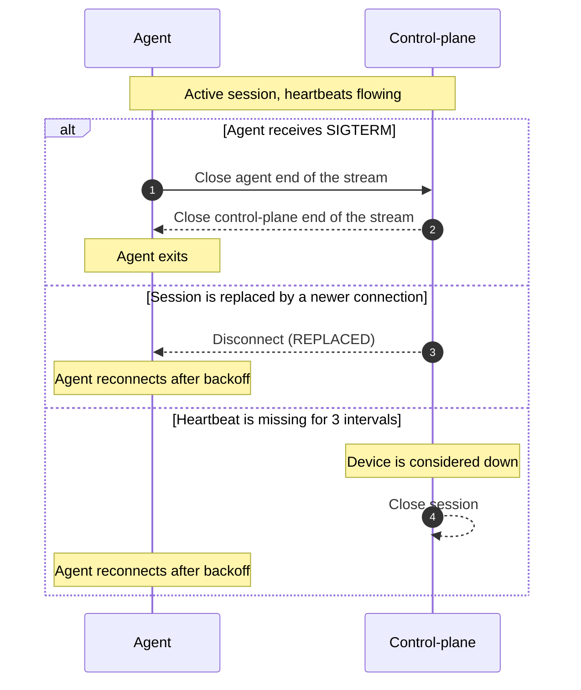
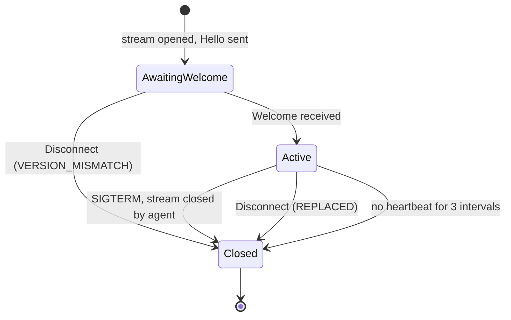

# 03. Protobug Contract between agent and control-plane

- **Status:** draft v0.1
- **Date:** 2026-10-10
- **Related documents:** 01-containers

## Who opens the stream?

The stream is opened by the agent via `Hello` message to control-plane.

Firstly, the `Hello` msg is sent to control-plane.
In response it receives the `Welcome` msg with `session_id` and heartbeat interval.

`Hello` and `Welcome` msgs contain version info about control-plane and agent.
If major versions of protocol do not match - disconnect with reason "version mismatch".

The end machine is to be considered **down** when hearbeat doesn't reach control-plane in 3 intervals.

If the same device tries to connect the second time, the second connection breaks the first one with reason "replaced".

On `SIGTERM` the agent closes the steam on its end, control plane answers with closing its end.

## Connection

## Disconnection

## Session states

